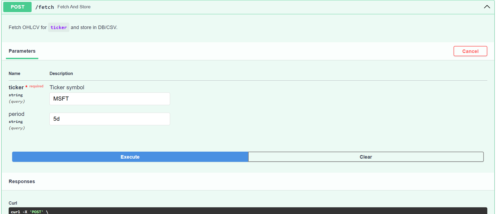
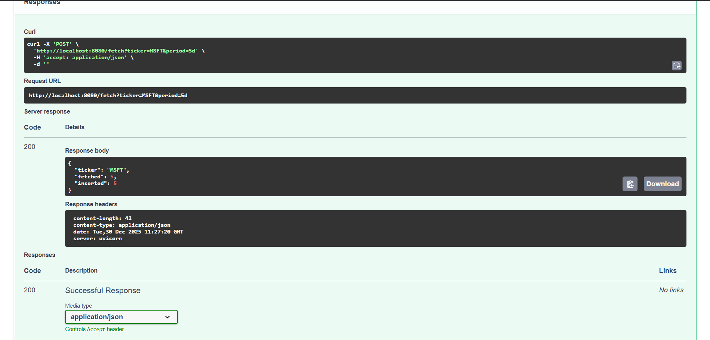
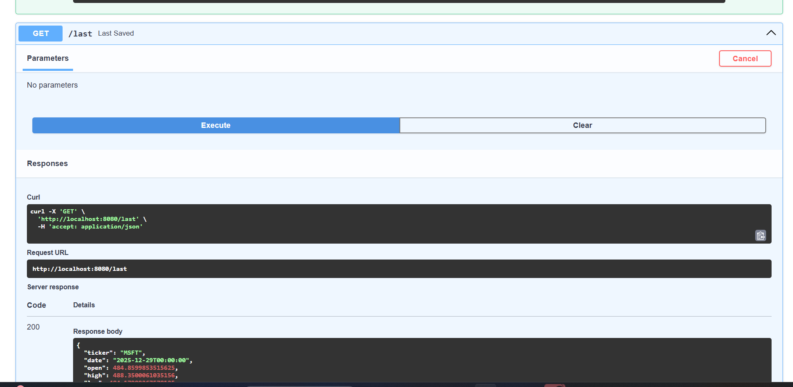
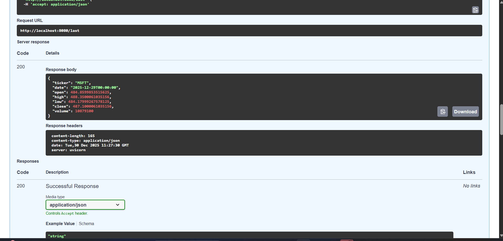
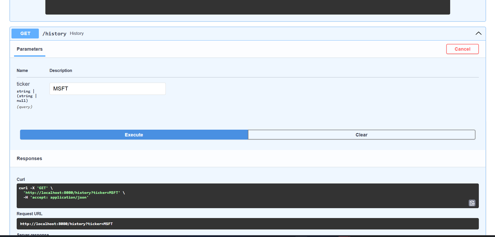
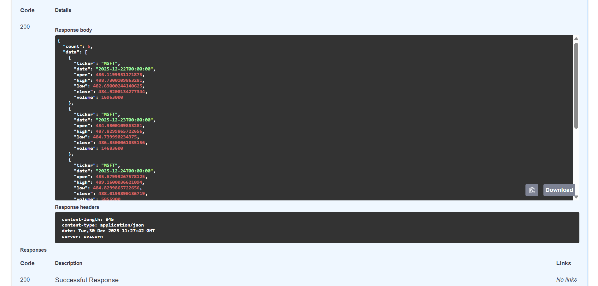

# stock_service

Simple FastAPI service to fetch stock quotes via `yfinance` and persist to SQLite/CSV.

Project layout

- app/: application package
  - `main.py`: FastAPI entrypoint and endpoints
  - `fetcher.py`: yfinance interaction
  - `storage.py`: SQLite/CSV helpers
  - `config.py`: settings via pydantic
- tests/: pytest unit tests
- data/: runtime data files (DB/CSV)

Quick start


```

Docker

```bash
docker build -t stock_service .
docker run -p 8000:8000 stock_service
```

Tests

```bash
pytest -q
```

API Endpoints

- `POST /fetch?ticker=TSLA&period=5d` : fetch OHLCV for the given ticker and persist to DB/CSV.
- `GET /last` : returns the most-recent saved OHLCV row.
- `GET /history?ticker=TSLA` : returns stored history (all tickers if `ticker` omitted).

Images

The following screenshots illustrate the UI and example responses for the main endpoints.

-   Fetch form in Swagger UI
-   Example JSON response from `POST /fetch`
-   `GET /last` request in Swagger UI
-   Example JSON response from `GET /last`
-   `GET /history` request in Swagger UI
-   Example JSON response from `GET /history`
Decisions & Trade-offs

- SQLite chosen over CSV to ensure data integrity and to allow a UNIQUE constraint (`ticker`,`date`) to prevent duplicates and support efficient queries.
- `yfinance.download` used for batch OHLCV retrieval and parsed into a normalized list of rows for DB insertion.

Scaling notes

- To scale to multiple tickers, run fetches concurrently using asyncio or background workers (Celery/RQ). Use caching and rate-limiting to avoid hitting Yahoo limits.
- For production, move DB to a managed store (Postgres) and add migrations.


Answers To Questions

Q1 How would this scale to handle 10 tickers concurrently?

Answer: To scale from a single one to 10 concurrent ones we should avoid sequential polling instead we should run the fetch operation using async I/O and a background scheluder like APIScheleduler or celery , then we would store the data into the SQLite db tagged by ticker then create a loop to fetch each one independently

Why this fits the assignment:
It preserves separation of concerns as expected in the architecture section on page 2 (no tangled single-file code).
Behavior remains configurable (tickers list is just config, no code change) as required.

Q2 How would you avoid API rate limits?

Answer: According to the Yahoo finance usage I would do Batch request sending and Caching the results on a short TTL

This aligns with the expectations to:
Avoid API calls in tight loops
Avoid calling the real API unnecessarily

Q3 What’s the first architectural change for production?

Answer: For a real world production environemnt we would have a queue 

(fetcher service) --> (Redis/Kafka queue) --> (storage writer) --> (API server)

Q4 What’s a trading-related pitfall using this setup as-is?

Answer: The system is not suitable for live trading because Data can be old because we are using polling and There is no garuntee of latency or time synchronization and one missed or broken api call can cause wrong data on the user side we would need to add protections 


